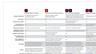

# InDesign

L&#39;app standard del settore per creare documenti eccezionali per la stampa e il publishing digitale. Crea esperienze digitali e di stampa avanzate, da eBook e riviste elettroniche a libri, rapporti e white paper.

## Sfoglia Tutorials di prodotti

<table style="table-layout:fixed">
<tr>
 <td>
    
    

    <a href="indesign.md#tutorial1"><strong>Genera codici QR</strong></a>
    

    <em>Generazione di un codice QR con collegamento a un sito Web</em>
     
  </td>
  <td>
   
    

   <a href="indesign.md#tutorial2"><strong>Condividi per la revisione dall'InDesign</strong></a>
    

    <em>Esperienza di revisione creativa uniforme per i progettisti e i membri del gruppo</em>
     
  </td>
  <td>
    
    

    <a href="indesign.md#tutorial3"><strong>Importare commenti PDF da un documento 
Revisione cloud</strong></a>
    

    <em>Importare commenti da un PDF direttamente in InDesign e applicare rapidamente le modifiche richieste</em>
     
  </td>
</tr>
<tr>
<td>
   
    

   <a href="indesign.md#tutorial4"><strong>Aggiungi file video al documento InDesign</strong></a>
    

    <em>Aggiungi video all'InDesign. Output in PDF e pubblicazione online</em>
     
  </td>
 <td>
    
    

     
 </td>
 <td>
    
    

     
 </td>
</tr>
</table>

## Genera codici QR (2:34) {#tutorial1}

>[!VIDEO](https://video.tv.adobe.com/v/326818?hidetitle=true)

**Descrizione**
Generare un codice QR con collegamento a un sito Web.

In questo tutorial, scoprirai come:
* Accesso pratico ai contenuti Web tramite dispositivi mobili
* Fai sentire i tuoi clienti al sicuro
* Digitale significa che è facile aggiornare i contenuti

**Presentato da:**
Patti Sokol, Consulente Principal Solutions (Digital Media)

## Condividi per revisione da InDesign (4:04) {#tutorial2}

>[!VIDEO](https://video.tv.adobe.com/v/326824?hidetitle=true)

**Descrizione**
La funzione Condividi per revisione degli InDesign offre un’esperienza di revisione creativa ancora più fluida per i progettisti e i membri del loro team.

In questo tutorial imparerai come:
* Avviare una revisione direttamente dall&#39;InDesign senza dover creare un PDF
* Revisione e inserimento di commenti da un browser Web
* Raccogli i commenti di più stakeholder in un&#39;unica posizione
* Gestisci i feedback in-app dove è possibile apportare immediatamente le modifiche.

**PDF di confronto opzioni Adobe revisione e commento**

**Presentato da:**
Emily Palmer, Consulente per le soluzioni (Digital Media)

## Importare commenti PDF da una revisione del Document Cloud (4:52) {#tutorial3}

>[!VIDEO](https://video.tv.adobe.com/v/326959?hidetitle=true)

**Descrizione**
Importa i commenti da un PDF direttamente in InDesign e applica rapidamente le modifiche richieste.

In questo tutorial imparerai come:
* Supporta i flussi di lavoro esistenti per la creazione di commenti PDF
* Funziona con PDF combinati da più sorgenti

**PDF di confronto opzioni Adobe revisione e commento**

**Presentato da:**
Michael Murphy, Consulente Senior Solutions (Digital Media)

## Aggiungi file video a documento InDesign (5:58) {#tutorial4}

>[!VIDEO](https://video.tv.adobe.com/v/326757?hidetitle=true)

**Descrizione**
Aggiungi video all’InDesign. Output in PDF e pubblicazione online.

In questo tutorial imparerai come:
* Aggiungere video all’InDesign
* Output in PDF e pubblicazione online

**Presentato da:**
Patti Sokol, Consulente Principal Solutions (Digital Media)

**Risorse InDesign**

[Informazioni e supporto](https://helpx.adobe.com/support/indesign.html) è il tuo hub per ulteriori esercitazioni, [Novità](https://helpx.adobe.com/indesign/user-guide.html/indesign/using/whats-new.ug.html) e collegamenti ai forum della community.

**Versione di ottobre 2020**

Inizia a utilizzare queste funzioni (e molto altro) scaricando l’aggiornamento più recente dall’app desktop Creative Cloud.
