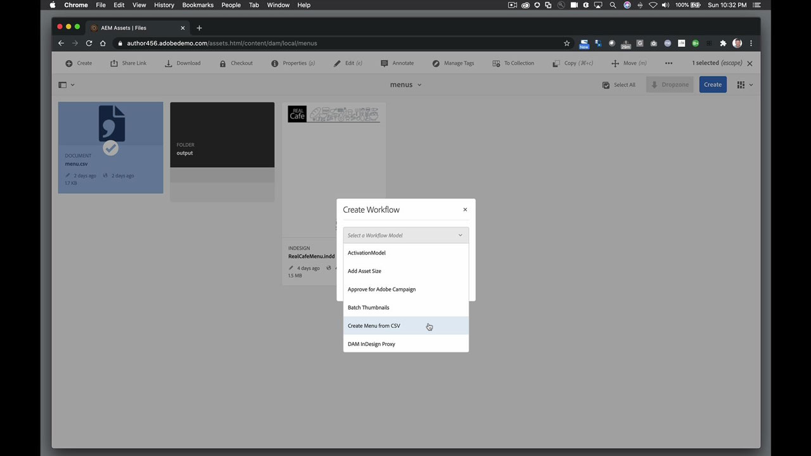

# InDesign Server

Il software Adobe InDesign® Server offre un motore solido e scalabile che sfrutta le funzionalità di progettazione, layout e composizione tipografica di InDesign per consentire la creazione di documenti automatizzati coinvolgenti a livello di programmazione.

## Sfoglia Tutorials di prodotti

<table style="table-layout:fixed">
<tr>
 <td>
   
    

   <a href="indesignserver.md#tutorial1"><strong>Contenuto InDesign Server basato su dati</strong></a>
    

    <em>La progettazione basata sui dati può essere realizzata a livello di programmazione con InDesign Server</em>
     
  </td>
  <td>
    
    

     
  </td>
  <td>
    
    

     
  </td>
</tr>
</table>

## Contenuto InDesign Server Basato Su Dati (4:14) {#tutorial1}

>[!VIDEO](https://video.tv.adobe.com/v/326901?hidetitle=true)

**Descrizione**
La progettazione basata sui dati può essere realizzata, a livello di programmazione, con l&#39;InDesign Server.

In questo tutorial imparerai come:
* Creare modelli di InDesign con testo o stili oggetto preformattati
* Flusso di contenuti esterni basati su dati per una personalizzazione più rapida dei contenuti
* Generare PDF spot-on o collegare il layout ad altri formati di output guidati dall’AEM

**Presentato da:**
Eric Rowse, Consulente Senior Solutions (Digital Media)

## Risorse InDesign Server aggiuntive

<table>
<tr>
 <td>
   
    

   <a href="https://www.adobe.com/products/indesignserver/buying-guide.html"><strong>InDesign Server: guida all'acquisto</strong></a>
    

    <em>Risorse disponibili per sviluppatori o partner interni</em>
     
  </td>
  <td>
   
    

   <a href="https://www.adobe.com/products/indesignserver/partner.html"><strong>InDesign Server: Trova un partner</strong></a>
    

    <em>Pur disponendo delle competenze necessarie per lo sviluppo interno, Adobe consiglia di collaborare con i partner per trovare la soluzione più adatta alle proprie esigenze</em>
     
  </td>
  <td>
    
    

     
  </td>
</tr>
</table>

**Risorse InDesign Server**

[Informazioni e supporto](https://www.adobe.com/products/indesignserver.html) è il tuo hub per esercitazioni aggiuntive, novità e collegamenti ai forum della community.

**Versione di ottobre 2020**

Inizia a utilizzare queste funzioni (e molto altro) scaricando l’aggiornamento più recente dall’app desktop Creative Cloud.
