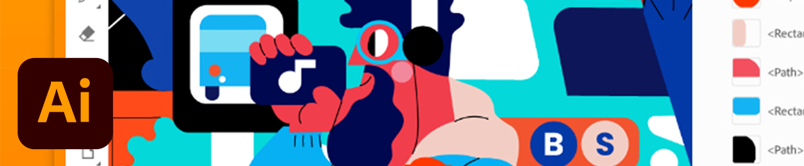

# Esercitazioni

In qualità di creativo aziendale, devi collaborare con team distribuiti, stabilire processi scalabili e rispettare i sistemi e le linee guida aziendali. Questi tutorial ti aiuteranno ad apprendere le nuove funzioni della versione 2021 di Creative Cloud, da una prospettiva aziendale.

## Tutorials per prodotti desktop

<table style="table-layout:fixed">
<tr>
 <td>
    
    

    <a href="acrobat-sign.md"><strong>Acrobat e Adobe Sign</strong></a>
    

    <em>Creazione, modifica e firma di documenti e moduli PDF</em>
     
  </td>
  <td>
    
    

    <a href="dimension.md"><strong>Dimension</strong></a>
    

    <em>Crea immagini 3D fotorealistiche per branding, foto di prodotti e progettazione di pacchetti</em>
     
  </td>
  <td>
    
    

    <a href="illustrator.md"><strong>Illustrator</strong></a>
    

    <em>Grafica vettoriale e illustrazione</em>
     
  </td>
</tr>
<tr>
 <td>
    
    

    <a href="indesign.md"><strong>InDesign</strong></a>
    

    <em>Progettazione e layout di pagine per la stampa e la pubblicazione digitale</em>
     
  </td>
  <td>
    
    

    <a href="photoshop.md"><strong>Photoshop</strong></a>
    

    <em>Modifica, componi e crea bellissime immagini, grafica e grafica sul desktop</em>
     
  </td>
  <td>
    
    

    <a href="rush.md"><strong>Rush</strong></a>
    

    <em>Crea e condividi video online ovunque ti trovi</em>
     
  </td>
</tr>
<tr>
 <td>
    
    

    <a href="xd.md"><strong>XD</strong></a>
    

    <em>Progettazione, prototipazione e condivisione di esperienze utente</em>
     
  </td>
  <td>
    
    

     
  </td>
  <td>
    
    

     
  </td>
</tr>
</table>

### Tutorials per app mobile

<table style="table-layout:fixed">
<tr>
 <td>
    
    

    <a href="capture.md"><strong>Capture</strong></a>
    

    <em>Trasforma qualsiasi immagine in tema colore, grafica vettoriale, pennello e altro ancora</em>
     
  </td>
  <td>
    
    

    <a href="fresco.md"><strong>Fresco</strong></a>
    

    <em>Riscopri il piacere di disegnare e dipingere ovunque</em>
     
  </td>
  <td>
    
    

    <a href="illustratoripad.md"><strong>Illustrator su iPad</strong></a>
    

    <em>Grafica vettoriale e illustrazione</em>
     
  </td>
</tr>
<tr>
 <td>
    
    

    <a href="photoshopipad.md"><strong>Photoshop su iPad</strong></a>
    

    <em>Modifica, componi e crea immagini, grafica e grafica stupende su desktop e iPad</em>
     
  </td>
  <td>
    
    

     
  </td>
  <td>
    
    

     
  </td>
</tr>
</table>

### Tutorials per integrazione

<table style="table-layout:fixed">
<tr>
 <td>
    
    

    <a href="aem.md"><strong>AEM Assets e Asset Link</strong></a>
    

    <em>Gestione delle risorse digitali di nuova generazione</em>
     
  </td>
  <td>
    
    

    <a href="creativeclouddesktopapp.md"><strong>Creative Cloud app desktop</strong></a>
    

    <em>L'app desktop Creative Cloud è il tuo hub per la gestione di app, servizi e collaborazione CC e altro ancora.</em>
     
  </td>
  <td>
    
    

    <a href="cclibraries.md"><strong>CC Libraries</strong></a>
    

    <em>Mantieni le tue risorse a portata di mano e i tuoi progetti sul marchio</em>
     
  </td>
</tr>
<tr>
<td>
    
    

    <a href="indesignserver.md"><strong>InDesign Server</strong></a>
    

    <em>Gli strumenti sofisticati dell'InDesign abbinati all'automazione personalizzata</em>
     
  </td>
 <td>
    
    

    <a href="stock.md"><strong>Adobe [!DNL Stock]</strong></a>
    

    <em>Immagini digitali, illustrazioni, video, audio, modelli e altro ancora di alta qualità</em>
     
  </td>
  <td>
    
    

     
  </td>
</tr>
</table>

### Progetto pratico: creare una maschera viso personalizzata

<table style="table-layout:fixed">
<tr>
 <td>
    
    

    <a href="handsonproject.md"><strong>Creare una maschera personalizzata</strong></a>
    

    <em>Con il plug-in di progettazione per la stampa di Adobe, puoi visualizzare i tuoi progetti su centinaia di prodotti Zazzle e pubblicarli direttamente sul loro marketplace online</em>
     
  </td>
  <td>
    
    

     
  </td>
  <td>
    
    

     
  </td>
</tr>
</table>
