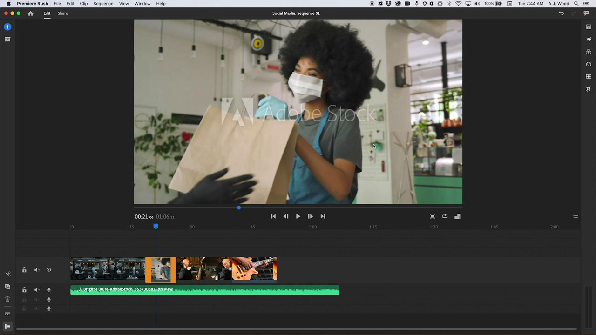

# [!DNL Rush]

Premiere [!DNL Rush] è la prima app di editing video per più dispositivi completa che consente di creare e condividere contenuti online in modo più semplice che mai. Questa soluzione desktop e mobile integrata sincronizza automaticamente i progetti e le modifiche nel cloud, consentendoti di lavorare ovunque e su qualsiasi dispositivo.

## Sfoglia Tutorials di prodotti

<table style="table-layout:fixed">
<tr>
 <td>
   
    

   <a href="rush.md#tutorial1"><strong>Creare un video per social media</strong></a>
    

    <em>Adobe [!DNL Rush] consente di lavorare su qualsiasi dispositivo e semplifica l'output professionale per i principianti</em>
     
  </td>
  <td>
    
    

     
  </td>
  <td>
    
    

     
  </td>
</tr>
</table>

## Crea un video sui social media (18:11) {#tutorial1}

>[!VIDEO](https://video.tv.adobe.com/v/326900?hidetitle=true)

**Descrizione**
Racconta la tua storia utilizzando video e audio dall&#39;Adobe [!DNL Stock]. Adobe [!DNL Rush] ti consente di lavorare su qualsiasi dispositivo e rende l&#39;output professionale abbastanza semplice per i principianti.

In questo tutorial imparerai come:
* Editing video fluido su desktop, tablet e telefono
* Mantieni il soggetto centrato su fattori di forma orizzontali, quadrati e verticali con la funzione della tecnologia di intelligenza artificiale Reframe automatico
* I modelli di grafica animata (MoGRTS) consentono l’aspetto professionale e la facile personalizzazione dei titoli e dei terzi inferiori
* Esporta e pubblica facilmente direttamente sui canali di social media
* Apri [!DNL Rush] progetti in Adobe Premiere Pro

**Presentato da:**
A.J. Wood, consulente per le soluzioni (Digital Media)

**[!DNL Rush]risorse**

[Informazioni e supporto](https://helpx.adobe.com/it/support/premiere-rush.html) è il tuo hub per ulteriori esercitazioni, [Novità](https://helpx.adobe.com/it/premiere-rush/user-guide.html/premiere-rush/help/whats-new.ug.html) e collegamenti ai forum della community.

**Versione di ottobre 2020**

Inizia a utilizzare queste funzioni (e molto altro) scaricando l’aggiornamento più recente dall’app desktop Creative Cloud.
