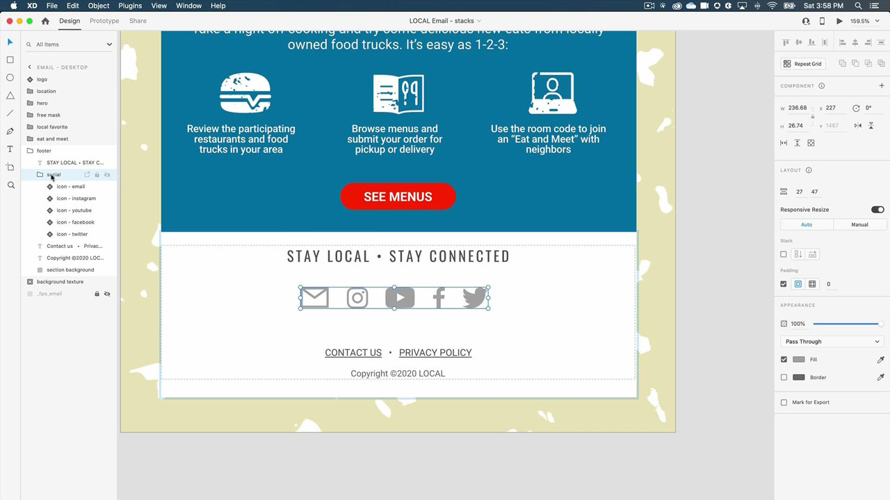

# XD

Adobe XD è uno strumento di progettazione e prototipazione dell’esperienza utente per la progettazione di siti Web, app, interfacce vocali, giochi e altri tipi di esperienze digitali.

## Sfoglia Tutorials di prodotti

<table style="table-layout:fixed">
<tr>
 <td>
   
    

   <a href="xd.md#tutorial1"><strong>Creazione di componenti con stati al passaggio del mouse</strong></a>
    

    <em>Creazione di pulsanti riutilizzabili e ridimensionabili dinamicamente per le progettazioni interattive</em>
     
  </td>
  <td>
    
    

    <a href="xd.md#tutorial2"><strong>Creare e popolare una griglia di ripetizione</strong></a>
    

    <em>Trasformare un singolo elemento in griglie ripetute con un semplice clic e trascinamento</em>
     
  </td>
  <td>
   
    

    <a href="xd.md#tutorial3"><strong>Utilizzo delle pile</strong></a>
    

    <em>Utilizzare la proprietà stack per ridisporre facilmente gli elementi</em>
     
  </td>
</tr>
<tr>
 <td>
    
    

    <a href="xd.md#tutorial4"><strong>Creare un prototipo: collegamenti di ancoraggio e gruppi di scorrimento</strong></a>
    

    <em>Aggiunta della navigazione e scorrimento a un prototipo</em>
     
  </td>
  <td>
    
    

    <a href="xd.md#tutorial5"><strong>Creazione di un prototipo - Stati dei componenti interattivi</strong></a>
    

    <em>Aggiunta di un menu di interattività e sovrapposizione a un prototipo</em>
     
  </td>
  <td>
   
    

   <a href="xd.md#tutorial7"><strong>E-mail: creare e popolare una griglia di ripetizione</strong></a>
    

    <em>Trasformare un singolo elemento in griglie ripetute con un semplice clic e trascinamento</em>
     
  </td>
</tr>
<tr>
 <td>
    
    

    <a href="xd.md#tutorial7"><strong>E-mail - Lavorare con le pile</strong></a>
    

    <em>Utilizzare la proprietà stack per ridisporre facilmente gli elementi</em>
     
  </td>
  <td>
    
    

     
  </td>
  <td>
    
    

     
  </td>
</tr>
</table>

## Crea [!UICONTROL Componenti] con Stati Passaggio (7:35) {#tutorial1}

>[!VIDEO](https://video.tv.adobe.com/v/326874?hidetitle=true)

**Descrizione**
Crea pulsanti riutilizzabili e ridimensionabili dinamicamente per i tuoi progetti interattivi.

In questo tutorial imparerai come:
* Apporta modifiche a un componente principale di origine e tali modifiche vengono inviate automaticamente a tutte le istanze di quel componente
* Utilizzo dei componenti per coerenza, risparmio di tempo e minor numero di clic

**Presentato da:**
Michael Murphy, Consulente Senior Solutions (Digital Media)

## Creare e popolare una griglia di ripetizione (2:57) {#tutorial2}

>[!VIDEO](https://video.tv.adobe.com/v/326955?hidetitle=true)

**Descrizione**
Trasforma un singolo elemento in griglie ripetute con un semplice clic e trascinamento.

In questo tutorial imparerai come:
* Migliora il tuo flusso di lavoro e trascina istantaneamente la griglia di qualsiasi dimensione necessaria
* Inserisci contenuti e dati reali e l&#39;XD magicamente posizionerà tutte le immagini e il testo nella tua griglia
* Apporta le modifiche una volta e applicale dove preferisci, in qualsiasi direzione

**Presentato da:**
Ashley Dvorin, Consulente Senior Solutions (Digital Media)

## Utilizzo delle pile (5:33) {#tutorial3}

>[!VIDEO](https://video.tv.adobe.com/v/326956?hidetitle=true)

**Descrizione**
Utilizza la proprietà stack per ridisporre facilmente gli elementi.

In questo tutorial imparerai come:
* Mantenere l&#39;allineamento e la spaziatura tra gli oggetti sull&#39;area di lavoro anche quando cambia la progettazione
* Inserisci nuovi oggetti o riordina gli oggetti in una pila e tutto si regola automaticamente

**Presentato da:**
Michael Murphy, Consulente Senior Solutions (Digital Media)

## Crea un prototipo - Collegamenti di ancoraggio e gruppi di scorrimento (9:55) {#tutorial4}

>[!VIDEO](https://video.tv.adobe.com/v/326957?hidetitle=true)

**Descrizione**
Aggiungi navigazione e scorrimento a un prototipo.

In questo tutorial imparerai come:
* Aggiunta di collegamenti ai prototipi con un&#39;azione che consente agli utenti di passare a punti diversi sulla stessa tavola da disegno
* Crea feed di attività, caroselli di immagini, elenchi di prodotti e altro ancora definendo aree che scorrono indipendentemente dal resto dei tuoi progetti
* Crea gruppi che scorrono in verticale, in orizzontale o in entrambe le direzioni

**Presentato da:**
Michael Murphy, Consulente Senior Solutions (Digital Media)

## Creazione di un prototipo - Stati dei componenti interattivi (8:55) {#tutorial5}

>[!VIDEO](https://video.tv.adobe.com/v/326958?hidetitle=true)

**Descrizione**
Aggiungi interattività e un menu di sovrapposizione a un prototipo.

In questo tutorial imparerai come:
* Crea un&#39;esperienza utente animata e interattiva non lineare senza la necessità di tavole da disegno aggiuntive
* Creazione di più flussi di prototipi o interazioni in un singolo documento XD e pubblicazione di collegamenti condivisibili univoci per ogni flusso

**Presentato da:**
Emilie Enke, Consulente Soluzioni Associate (Media Digitali)

## E-mail - Creare e popolare una griglia di ripetizione (4:45) {#tutorial6}

>[!VIDEO](https://video.tv.adobe.com/v/326775?hidetitle=true)

**Descrizione**
Trasforma un singolo elemento in griglie ripetute con un semplice clic e trascinamento.

In questo tutorial imparerai come:
* Migliora il tuo flusso di lavoro e trascina istantaneamente la griglia di qualsiasi dimensione necessaria
* Inserisci contenuti e dati reali e l&#39;XD magicamente posizionerà tutte le immagini e il testo nella tua griglia
* Apporta le modifiche una volta e applicale dove preferisci, in qualsiasi direzione

**Presentato da:**
Victoria Torres, consulente per le soluzioni (Digital Media)

## E-mail - Lavorare con le pile (3:38) {#tutorial7}

>[!VIDEO](https://video.tv.adobe.com/v/326759?hidetitle=true)

**Descrizione**
Utilizza la proprietà stack per ridisporre facilmente gli elementi.

In questo tutorial imparerai come:
* Mantenere l&#39;allineamento e la spaziatura tra gli oggetti sull&#39;area di lavoro anche quando cambia la progettazione
* Inserisci nuovi oggetti o riordina gli oggetti in una pila e tutto si regola automaticamente

**Presentato da:**
Victoria Torres, consulente per le soluzioni (Digital Media)

**Risorse XD**

[Informazioni e supporto](https://helpx.adobe.com/support/xd.html) è il tuo hub per tutorial aggiuntivi, [Novità](https://helpx.adobe.com/xd/user-guide.html/xd/help/whats-new.ug.html)e collegamenti ai forum della community.

**Versione di ottobre 2020**

Inizia a utilizzare queste funzioni (e molto altro) scaricando l’aggiornamento più recente dall’app desktop Creative Cloud.
