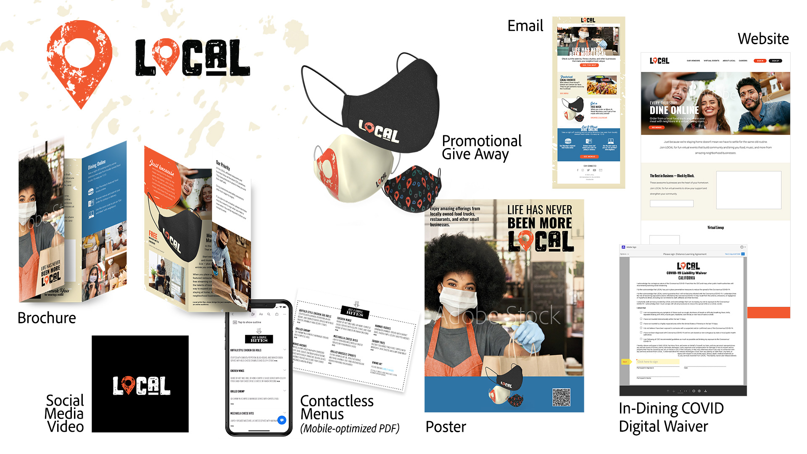

# MAX 2020 - sessioni aziendali

In qualità di creativo aziendale, devi collaborare con team distribuiti, stabilire processi scalabili e rispettare i sistemi e le linee guida aziendali. Queste esercitazioni ti aiuteranno ad apprendere le nuove funzioni della versione 2021 di Creative Cloud, da una prospettiva aziendale.

## Funzionamento su scala - Sfruttate la potenza di AEM Assets e InDesign Server (26:54)

>[!VIDEO](https://video.tv.adobe.com/v/327112?hidetitle=true)

**Descrizione**

Il vostro personale creativo impiega troppo tempo in attività manuali e ripetitive? Aiuta la tua organizzazione a sfruttare al meglio i creativi professionisti. AEM I sistemi aziendali, come &lt;unk> e InDesign Server, possono fornire al personale creativo e di produzione gli strumenti per distribuire rapidamente i contenuti nelle mani dei destinatari di destinazione.

In questa sessione dal vivo registrata, vedrai esempi di flussi di lavoro basati sui modelli in:
* Adobe Experience Manager AEM (&lt;unk>) Assets è una soluzione di gestione delle risorse digitali (DAM) che può integrarsi con Adobe Creative Cloud per consentire agli utenti di DAM di collaborare con i team creativi, semplificando la collaborazione nel processo di creazione dei contenuti
* Adobe InDesign Server è un motore di layout e composizione che alimenta le soluzioni di publishing automatizzate grazie all&#39;integrazione in altri sistemi

**Presentato da:**

Eric Rowse, Senior Solutions Consultant (Digital Media) Derek Lu, Principal Solutions Consultant (Proof of Concept)

## Nuovi strumenti per la nuova normale (29:57)

>[!VIDEO](https://video.tv.adobe.com/v/328232?hidetitle=true)

**Descrizione**

Il WFH ha portato delle sfide, ma ha anche costretto i creativi e le loro aziende a sperimentare nuovi strumenti e nuovi modi di creare. Esplora strumenti familiari come Illustrator e Photoshop nelle nuove versioni di iPad e disegna con Fresco su tablet (iPad, Microsoft Surface) e ora su iPhone!

In questa sessione dal vivo registrata, imparerai come:
* Usa vari pennelli e tecniche di ombreggiatura in Fresco per creare grafica per campagne disegnate a mano
* Creare e condividere icone con problemi di stress in Illustrator su iPad per abbinare il marchio
* Combinazione di grafica da Fresco e Illustrator su iPad per creare contenuti per i nostri canali social, in mobilità con Photoshop su iPad

**Presentato da:**

Dave Weinberg, Senior Solutions Consultant (Digital Media) Liz Tanonis, Solutions Consultant (Digital Media) Emilie Enke, Solutions Consultant (Digital Media)

## Collaborazione con CC Libraries (27:58)

>[!VIDEO](https://video.tv.adobe.com/v/328199?hidetitle=true)

**Descrizione**

Con Adobe Creative Cloud Libraries puoi gestire, organizzare e accedere a loghi, colori e altre risorse direttamente dalle tue app Creative Cloud preferite. Lavora in modo più efficiente, garantisci la coerenza creativa e resta facilmente sincronizzato con il tuo team.

In questa esercitazione verrà illustrato come:
* Trova facilmente le risorse necessarie in tutte le tue applicazioni creative
* Consenti ai comunicatori della tua organizzazione di creare esperienze in linea con il marchio, mantenendo allo stesso tempo il controllo

**Presentato da:**

Ashley Dvorin, Senior Solutions Consultant (Digital Media) Emily Palmer, Solutions Consultant (Digital Media)

## Informazioni sulle risorse demo: LOCALE

Il team si è avvicinato alla creazione delle risorse demo a seconda delle esigenze dell&#39;azienda. Abbiamo immaginato una campagna e creato risorse per vari canali. Abbiamo anche creato una CC Library con elementi di branding che supportano la collaborazione e la coerenza.

In risposta al COVID-19, LOCAL, una società che ospita eventi dal vivo che celebrano vacanze divertenti e stravaganti, ha dato vita a riunioni online e sta collaborando con piccoli camion alimentari locali e ristoranti per promuovere le loro attività—e aiutarli a rimanere aperti.

