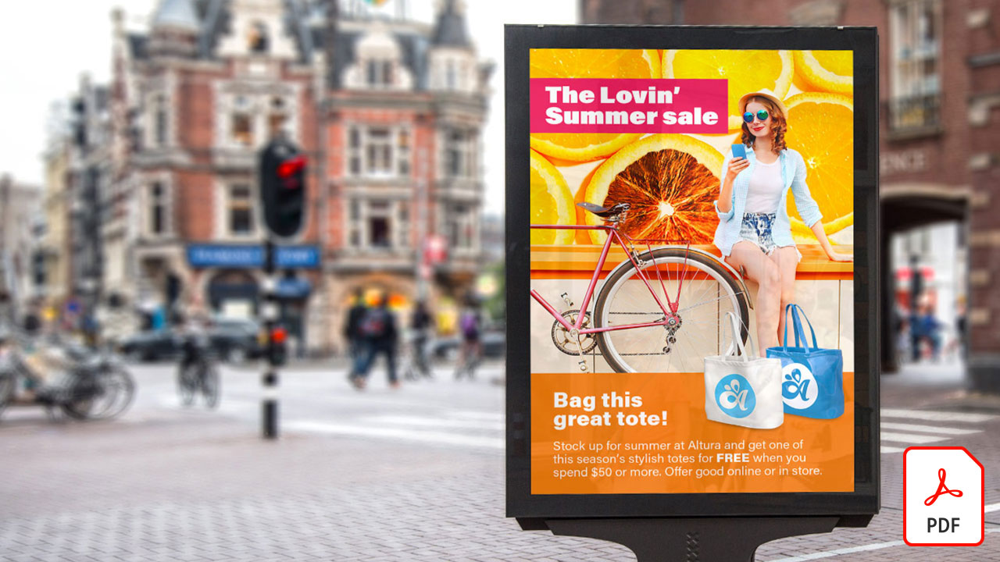

# Esercitazioni Adobe [!DNL Stock]

!

I creativi sono sotto pressione per fornire rapidamente nuovi contenuti visivamente interessanti che catturano e catturano l&#39;attenzione. Adobe [!DNL Stock] per l&#39;azienda consente ai team creativi di accedere a oltre 200 milioni di immagini, video, modelli, illustrazioni, file audio e risorse 3D - tutto dall&#39;interno delle app creative di Adobe che usano ogni giorno.

## Fare clic per visualizzare un&#39;esercitazione di Adobe [!DNL Stock]

<table>
<tr>
   <td>
      
      

      <a href="searchstock.md"><strong>Cerca nella cronologia licenze Adobe [!DNL Stock]</strong></a>
      

      <em>Informazioni su come cercare rapidamente la cronologia delle licenze di Adobe [!DNL Stock] nell'area Creative Cloud per l'azienda</em>
       
  </td>
  <td>
      
      

      <a href="handdrawn.md"><strong>Aggiungere un'estetica disegnata a mano alle immagini Adobe [!DNL Stock]</strong></a>
      

      <em>Aumentare la creatività di marketing con tecniche uniche che aggiungono profondità e dimensione alle immagini utilizzando Photoshop per iPad</em>
       
  </td>
  <td>
   
    

   <a href="flairtypography.md"><strong>Aggiungi flair alla tipografia con maschere e animazioni</strong></a>
    

    <em>Dare vita al testo con gli elementi di Adobe [!DNL Stock] e gli stili di animazione di After Effects</em>
     
  </td>
</tr>
<tr>
   <td>
      
      

      <a href="animatevector.md"><strong>Animate un'illustrazione vettoriale di Adobe [!DNL Stock] in Photoshop</strong></a>
      

      <em>Riportare l'animazione nella grafica della newsletter con vettori modificabili per Adobe [!DNL Stock]</em>
       
  </td>
   <td>
      
      

      <a href="annualreport.md"><strong>Inizia rapporto annuale con un video creato con Adobe [!DNL Stock] e Spark Video</strong></a>
      

      <em>Rendi il tuo rapporto annuale una storia con Adobe [!DNL Stock] e Spark Video</em>
       
  </td>
  <td>
      
      

      <a href="customanimations.md"><strong>Crea creatività con animazioni personalizzate di Adobe [!DNL Stock]</strong></a>
      

      <em>Utilizzate le immagini, le trame e i motivi di Adobe [!DNL Stock] per animazioni personalizzate in Photoshop</em>
       
  </td>
</tr>
<tr>
   <td>
      
      

      <a href="changecolors.md"><strong>Modificare i colori di un'immagine di Adobe [!DNL Stock] in modo che corrisponda alla vostra storia</strong></a>
      

      <em>Trovate una foto unica in Adobe [!DNL Stock], quindi regolate il colore in Adobe Photoshop per soddisfare le vostre esigenze</em>
       
  </td>
  <td>
      
      

      <a href="collage.md"><strong>Creare un collage 3D per un poster utilizzando immagini Adobe [!DNL Stock]</strong></a>
      

      <em>Progettare un collage in Adobe Illustrator che presenta un effetto 3D accattivante dalle immagini in Adobe [!DNL Stock]</em>
       
  </td>
  <td>
      
      

      <a href="boldlabel.md"><strong>Creare un'etichetta in grassetto con modelli Adobe [!DNL Stock] e Photoshop Smart Objects</strong></a>
      

      <em>Progettare e visualizzare i progetti personalizzati con modelli di imballaggio realistici da Adobe [!DNL Stock]</em>
       
  </td>
</tr>
<tr>
   <td>
      
      

      <a href="infographic.md"><strong>Creare un'infografica delle linee guida aziendali con Adobe [!DNL Stock]</strong></a>
      

      <em>Combinate varie risorse di Adobe [!DNL Stock] per comunicare le linee guida sotto forma di infografica visivamente convincente</em>
       
  </td>
 <td>
      
      

      <a href="featurecomparison.md"><strong>Creare un grafico di confronto delle feature di prodotto utilizzando Adobe [!DNL Stock]</strong></a>
      

      <em>Creare un'immagine che confronti i piani di determinazione dei prezzi dei prodotti per fornire ai potenziali clienti le informazioni di cui hanno bisogno a prima vista</em>
       
  </td>
  <td>
      
      

      <a href="surrealcomposite.md"><strong>Create un composito semi-surreale con Adobe [!DNL Stock]</strong></a>
      

      <em>Creare un'immagine editoriale memorabile combinando più immagini con colori, movimenti ed effetti di mascheramento</em>
       
  </td>
</tr>
<tr>
   <td>
      
      

      <a href="surrealpattern.md"><strong>Create una serie semi-surreale con Adobe [!DNL Stock]</strong></a>
      

      <em>Create un bellissimo modello senza interruzioni basato su immagini surreali di Adobe [!DNL Stock]</em>
       
  </td>
   <td>
      
      

      <a href="productconfigurator.md"><strong>Creare un configuratore di prodotto interattivo con Adobe [!DNL Stock]</strong></a>
      

      <em>Utilizzare la potenza dell'interattività, dell'animazione e dell'opera d'arte modificabile di Adobe [!DNL Stock] per presentare le informazioni finanziarie in modo visivo</em>
       
  </td>
  <td>
      
      

      <a href="interactivetourismphoto.md"><strong>Creare una foto del turismo interattiva con Adobe [!DNL Stock] e XD</strong></a>
      

      <em>Creare rapidamente una foto interattiva all'interno del prototipo del sito Web con Adobe [!DNL Stock] e XD</em>
       
  </td>
</tr>
<tr>
   <td>
      
      

      <a href="animationemail.md"><strong>Crea animazioni per la posta elettronica con Adobe [!DNL Stock] e Photoshop</strong></a>
      

      <em>Incentivare le e-mail con l'animazione Stop-Action con Adobe [!DNL Stock] e Photoshop</em>
       
  </td>
 <td>
      
      

      <a href="brandgradients.md"><strong>Creare immagini di marca coerenti con gradienti di qualità e con le risorse di Adobe [!DNL Stock]</strong></a>
      

      <em>Creare l'unità del marchio con immagini diverse combinando colori e sfumature nella campagna pubblicitaria</em>
       
   </td>
  <td>
      
      

      <a href="webgraphics.md"><strong>Creare elementi grafici Web coinvolgenti combinando le immagini Adobe [!DNL Stock] con CSS</strong></a>
      

      <em>Creare l'unità del marchio con immagini diverse combinando colori e sfumature nella campagna pubblicitaria</em>
       
  </td>
</tr>
<tr>
   <td>
      
      

      <a href="moodboard.md"><strong>Crea in breve tempo schede animate ispiratrici con Adobe [!DNL Stock]</strong></a>
      

      <em>Creare una scheda di stato per il progetto per il inoltro di informazioni, idee, immagini e tavolozze a colori a team/client</em>
       
  </td>
  <td>
      
      

      <a href="realisticcomposite.md"><strong>Crea compositi di foto realistici con immagini Adobe [!DNL Stock]</strong></a>
      

      <em>Riunisci due grandi foto di Adobe [!DNL Stock] per attirare l'attenzione delle persone sui vostri post sociali</em>
       
  </td>
   <td>
   
    

   <a href="loadingscreen.md"><strong>Personalizzare un'animazione della schermata di caricamento con Adobe [!DNL Stock] e XD</strong></a>
    

    <em>Personalizzare le opere vettoriali di Adobe [!DNL Stock] per creare un'animazione della schermata di caricamento refrigerante per un'app mobile</em>
     
  </td>
</tr>
<tr>
   <td>
   
    

   <a href="presentationtemplate.md"><strong>Personalizzare un modello di presentazione di Adobe [!DNL Stock] per sembrare professionale ma accattivante</strong></a>
    

    <em>Crea una bellissima presentazione stilizzata in pochi minuti con immagini e modelli di Adobe [!DNL Stock] e alcuni effetti speciali facili da fare</em>
     
  </td>
   <td>
   
    

   <a href="customizecolors.md"><strong>Personalizzare i colori in un'illustrazione vettoriale di Adobe [!DNL Stock]</strong></a>
    

    <em>Aggiungere lucidatura a qualsiasi progetto con un'illustrazione di grande aspetto. Trovate il vettore perfetto in Adobe [!DNL Stock], quindi confrontate i colori con la tavolozza del progetto utilizzando Adobe Illustrator</em>
     
  </td>
   <td>
      
      

      <a href="assets/AddMotiontoStillImageswithAdobeStockandPhotoshop.pdf"><strong>Aggiungere movimento alle immagini fisse con Adobe [!DNL Stock] e Photoshop (PDF)</strong></a>
      

      <em>Wow, il tuo pubblico su qualsiasi schermo incorpora video in un'immagine fissa</em>
       
   </td>
</tr>
<tr>
   <td>
   
    

   <a href="assets/CreateacompositewithPhotoshopontheiPadandAdobeStockimages.pdf"><strong>Create un composito con Photoshop sulle immagini iPad e Adobe [!DNL Stock] (PDF)</strong></a>
    

    <em>Impara a utilizzare una delle tue app Adobe Creative Cloud preferite in modo completamente nuovo con la potenza di Photoshop sul tuo iPad</em>
     
  </td>
   <td>
   
    

   <a href="assets/CreateaUniqueEditorialGraphicwithAfterEffectsandAdobeStock.pdf"><strong>Animate un'illustrazione vettoriale di Adobe [!DNL Stock] in Photoshop (PDF)</strong></a>
    

    <em>Combinando After Effects con Adobe [!DNL Stock], potete rapidamente creare straordinari effetti speciali che vi aiutano a raccontare visivamente una storia</em>
     
  </td>
   <td>
      
      

      <a href="assets/CreateUniqueGraphicsbyCombiningAdobeStockImages.pdf"><strong>Creare elementi grafici univoci combinando immagini Adobe [!DNL Stock] (PDF)</strong></a>
      

      <em>Unire due immagini diverse per creare una scena completamente nuova per i progetti di design. Adobe [!DNL Stock] e Adobe Photoshop semplificano le operazioni</em>
       
   </td>
</tr>
<tr>
   <td>
      
      

      <a href="assets/CreatingaHalloweenCinemagraphwithPhotoshopCCandAdobeStock.pdf"><strong>Creazione di un cinema di Halloween con Photoshop CC e Adobe [!DNL Stock] (PDF)</strong></a>
      

      <em>Creare un grafico componendo video, illustrazioni e foto con Adobe Photoshop</em>
       
  </td>
   <td>
      
      

      <a href="assets/PutyourDatainMotionwithAdobeStockandPremierePro.pdf"><strong>Mettere in moto i dati con Adobe [!DNL Stock] e Premiere Pro (PDF)</strong></a>
      

      <em>Rendi vivi i tuoi dati per raccontare una storia più convincente utilizzando Adobe [!DNL Stock] e Adobe Premiere Pro</em>
       
  </td>
   <td>
      
      

      <a href="assets/RecolorAdobeStockVectorArtworkwithAdobeIllustratortoGetExactlytheLookYouWant.pdf"><strong>Ricolora la grafica vettoriale di Adobe [!DNL Stock] con Adobe Illustrator per ottenere esattamente l'aspetto desiderato (PDF)</strong></a>
      

      <em>Adobe [!DNL Stock] semplifica la ricerca di immagini vettoriali univoche, e Adobe Illustrator vi permette di modificarle rapidamente per adattarle alla vostra visione creativa</em>
       
   </td>
 </tr> 
 <tr>
   <td>
      
      

      <a href="assets/ShowOffyourDesignWorkintheRealWorldwithAdobeStockandPhotoshop.pdf"><strong>Mostrate il vostro lavoro di progettazione nel mondo reale con Adobe [!DNL Stock] e Photoshop (PDF)</strong></a>
      

      <em>Seguire questa procedura per mostrare il lavoro in un modello di Adobe [!DNL Stock] realistico utilizzando Adobe Photoshop</em>
       
  </td>
   <td>
      
      

      <a href="assets/UncoveramazingdetailsinAdobeStockimageswithLightroomformobile.pdf"><strong>Scopri dettagli straordinari nelle immagini Adobe [!DNL Stock] con Lightroom per PC portatili (PDF)</strong></a>
      

      <em>Scopri la potenza della linea di illuminazione sul tuo dispositivo mobile per ottenere il meglio dalle immagini</em>
       
  </td>
   <td>
      
      

      <a href="assets/VisualizePosterDesignsintheRealWorldwithAdobeStockandPhotoshop.pdf"><strong>Visualizzate i manifesti nel mondo reale con Adobe [!DNL Stock] e Photoshop (PDF)</strong></a>
      

      <em>Mostrate le vostre creazioni in ambienti reali per avere un'idea migliore di come si guardano nel mondo</em>
       
  </td>
</tr>
</table>
