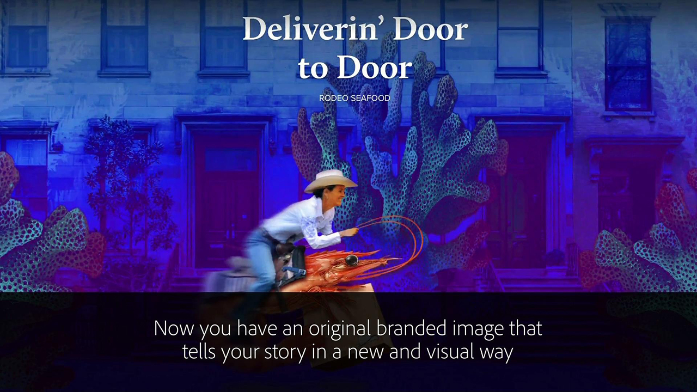
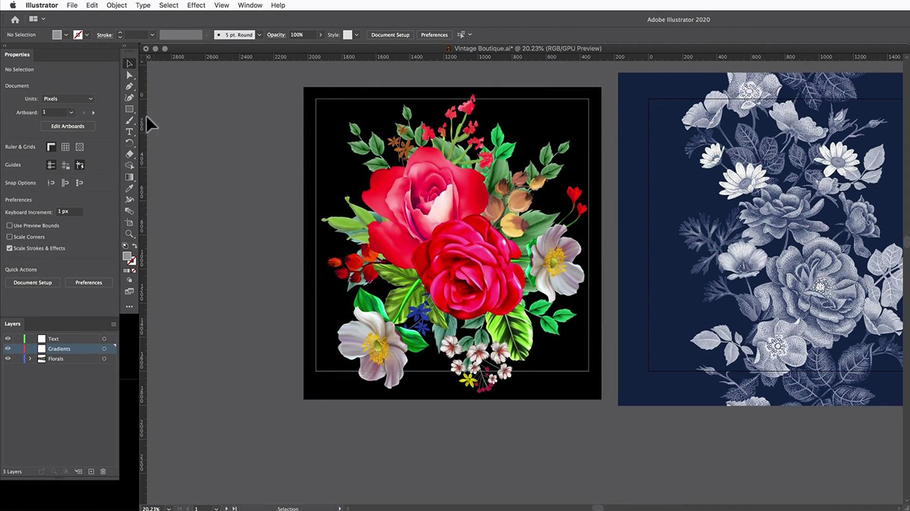
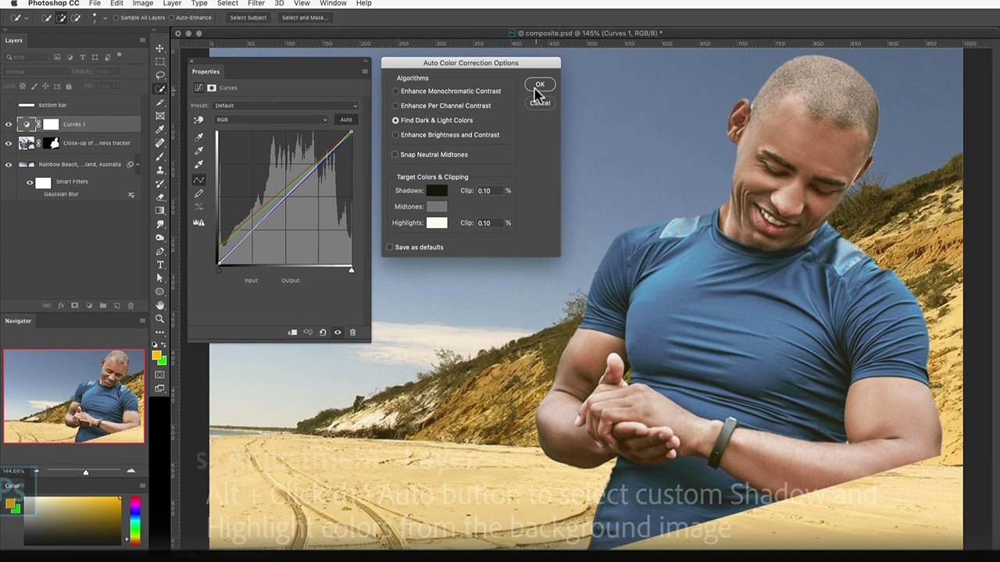

# Adobe [!DNL Stock] tutorial

I creativi sono sotto pressione per fornire rapidamente contenuti visivi coinvolgenti. Adobe Stock offre ai team creativi l&#39;accesso a più di 300 milioni di immagini, video, file audio, modelli, illustrazioni e risorse 3D esenti da royalty, all&#39;interno delle app Creative Cloud che utilizzano quotidianamente. Accedi senza limiti alle risorse standard di Adobe Stock con Creative Cloud Pro Edition. Scopri le raccolte più recenti su stock.adobe.com. Seleziona un’immagine per visualizzare un’esercitazione.

<table>
<tr>
   <td>
      
      

      <a href="stunning-digital-assets.md"><strong>Splendide risorse digitali (PDF)</strong></a>
      

      <em>Scoprite come integrare Adobe Stock con CC Libraries per creare risultati di progettazione coerenti e professionali per la stampa e lo schermo in questa esercitazione pratica</em>
       
  </td>
  <td>
      
      

      <a href="searchstock.md"><strong>Adobe di ricerca [!DNL Stock] cronologia licenze</strong></a>
      

      <em>Scopri come eseguire rapidamente ricerche nell’Adobe della tua organizzazione [!DNL Stock] cronologia delle licenze in Creative Cloud for enterprise</em>
       
  </td>
  <td>
      
      

      <a href="handdrawn.md"><strong>Aggiungere un'estetica disegnata a mano agli Adobi [!DNL Stock] immagini</strong></a>
      

      <em>Amplia il tuo marketing creativo con tecniche uniche che aggiungono profondità e dimensione alle tue immagini utilizzando Photoshop per iPad</em>
       
  </td>
  <td>
   
    

   <a href="flairtypography.md"><strong>Aggiungere stile alla composizione tipografica con maschere e animazioni</strong></a>
    

    <em>Dai vita al tuo testo con elementi dall'Adobe [!DNL Stock] e stili di animazione da After Effects</em>
     
  </td>
</tr>
<tr>
  <td>
      
      

      <a href="animatevector.md"><strong>Animare un Adobe [!DNL Stock] illustrazione vettoriale in Photoshop</strong></a>
      

      <em>Inserire animazioni nella grafica del notiziario con vettori modificabili, ad Adobe [!DNL Stock]</em>
       
  </td>
 <td>
      
      

      <a href="annualreport.md"><strong>Inizia il report annuale con un video creato con l’Adobe [!DNL Stock] e SPARK VIDEO</strong></a>
      

      <em>Rendi la tua relazione annuale una storia con degli Adobi [!DNL Stock] e SPARK VIDEO</em>
       
  </td>
  <td>
      
      

      <a href="customanimations.md"><strong>Dai vita alla creatività con animazioni personalizzate per Adobe [!DNL Stock]</strong></a>
      

      <em>Usa Adobe [!DNL Stock] immagini, trame, pattern alle animazioni personalizzate in Photoshop</em>
       
  </td>
  <td>
      
      

      <a href="changecolors.md"><strong>Modificare un Adobe [!DNL Stock] i colori dell'immagine in base alla tua storia</strong></a>
      

      <em>Trovare una foto unica nell’Adobe [!DNL Stock] quindi regolate il colore in Adobe Photoshop in base alle vostre esigenze</em>
       
  </td>
</tr>
<tr>
 <td>
      
      

      <a href="collage.md"><strong>Creazione di un collage 3D per un poster utilizzando l'Adobe [!DNL Stock] immagini</strong></a>
      

      <em>Progetta un collage in Adobe Illustrator che presenta un effetto 3D accattivante dalle immagini in Adobe [!DNL Stock]</em>
       
  </td>
  <td>
      
      

      <a href="boldlabel.md"><strong>Creare un'etichetta in grassetto con Adobe [!DNL Stock] modelli e oggetti avanzati di Photoshop</strong></a>
      

      <em>Progetta e visualizza i tuoi progetti personalizzati con modelli di packaging realistici da Adobe [!DNL Stock]</em>
       
  </td>
  <td>
      
      

      <a href="infographic.md"><strong>Creazione di un'infografica sulle linee guida aziendali con Adobe [!DNL Stock]</strong></a>
      

      <em>Combinare varie risorse da un Adobe [!DNL Stock] comunicare le linee guida sotto forma di infografiche visivamente coinvolgenti</em>
       
  </td>
 <td>
      
      

      <a href="featurecomparison.md"><strong>Creazione di un grafico di confronto delle funzionalità del prodotto utilizzando l'Adobe [!DNL Stock]</strong></a>
      

      <em>Crea un grafico che confronta i piani di prezzo dei prodotti per fornire ai potenziali clienti le informazioni di cui hanno bisogno in breve</em>
       
  </td>
</tr>
<tr>
   <td>
      
      

      <a href="surrealcomposite.md"><strong>Creazione di una composizione semi-surreale con Adobe [!DNL Stock]</strong></a>
      

      <em>Crea un'immagine editoriale memorabile combinando più immagini con effetti di colore, movimento e mascheratura</em>
       
  </td>
   <td>
      
      

      <a href="surrealpattern.md"><strong>Creazione di un pattern semi-surreale con Adobe [!DNL Stock]</strong></a>
      

      <em>Crea uno splendido pattern uniforme basato su immagini surreali di Adobi [!DNL Stock]</em>
       
  </td>
   <td>
      
      

      <a href="productconfigurator.md"><strong>Creazione di un configuratore di prodotti interattivo con Adobe [!DNL Stock]</strong></a>
      

      <em>Sfrutta le potenzialità di interattività, animazione e grafica modificabile di Adobe [!DNL Stock] per presentare le informazioni finanziarie in modo visivo</em>
       
  </td>
  <td>
      
      

      <a href="interactivetourismphoto.md"><strong>Crea una foto turistica interattiva con l'Adobe [!DNL Stock] e XD</strong></a>
      

      <em>Crea rapidamente una foto interattiva all'interno del prototipo del tuo sito Web con Adobe [!DNL Stock] e XD</em>
       
  </td>
</tr>
<tr>
 <td>
      
      

      <a href="animationemail.md"><strong>Creazione di animazioni per e-mail con Adobe [!DNL Stock] e PHOTOSHOP</strong></a>
      

      <em>Potenziare le e-mail con l'animazione stop-action con l'Adobe [!DNL Stock] e PHOTOSHOP</em>
       
  </td>
  <td>
      
      

      <a href="brandgradients.md"><strong>Crea immagini coerenti del marchio con splendide sfumature e Adobe [!DNL Stock] risorse</strong></a>
      

      <em>Crea l'unità del marchio con immagini diverse combinando colori e sfumature nella tua campagna pubblicitaria</em>
       
   </td>
  <td>
      
      

      <a href="webgraphics.md"><strong>Crea grafica Web coinvolgente combinando l'Adobe [!DNL Stock] immagini con CSS</strong></a>
      

      <em>Crea l'unità del marchio con immagini diverse combinando colori e sfumature nella tua campagna pubblicitaria</em>
       
  </td>
  <td>
      
      

      <a href="moodboard.md"><strong>Crea tavole di stile ispiratrici in pochissimo tempo con l'Adobe [!DNL Stock]</strong></a>
      

      <em>Crea una bacheca di stato d’animo del progetto per trasmettere informazioni, idee, elementi visivi e tavolozze di colori a team/clienti</em>
       
  </td>
</tr>
<tr>
   <td>
      
      

      <a href="realisticcomposite.md"><strong>Realizza composizioni fotografiche realistiche con Adobe [!DNL Stock] immagini</strong></a>
      

      <em>Riunisci due Adobi straordinari [!DNL Stock] foto per attirare le persone nei tuoi post social</em>
       
  </td>
   <td>
   
    

   <a href="loadingscreen.md"><strong>Personalizzare l’animazione di una schermata di caricamento con Adobe [!DNL Stock] e XD</strong></a>
    

    <em>Personalizzare la grafica vettoriale dall'Adobe [!DNL Stock] per creare un'animazione con schermata di caricamento più fredda per un'app per dispositivi mobili</em>
     
  </td>
  <td>
   
    

   <a href="presentationtemplate.md"><strong>Personalizzare un Adobe [!DNL Stock] un modello di presentazione professionale ma accattivante</strong></a>
    

    <em>Crea in pochi minuti una splendida presentazione stilizzata con immagini e modelli di Adobe [!DNL Stock] e alcuni effetti speciali facili da fare</em>
     
  </td>
   <td>
   
    

   <a href="customizecolors.md"><strong>Personalizzare i colori in un Adobe [!DNL Stock] illustrazione vettoriale</strong></a>
    

    <em>Aggiungi il tocco a qualsiasi progetto con un'illustrazione di grande impatto. Trovare il vettore perfetto in Adobe [!DNL Stock]e quindi abbinare i colori alla tavolozza del tuo progetto utilizzando Adobe Illustrator</em>
     
  </td>
</tr>
<tr>
   <td>
      
      

      <a href="assets/AddMotiontoStillImageswithAdobeStockandPhotoshop.pdf"><strong>Aggiungere movimento alle immagini fisse con Adobe [!DNL Stock] e Photoshop (PDF)</strong></a>
      

      <em>Sorprendi il tuo pubblico su qualsiasi schermo incorporando il video in un'immagine fissa</em>
       
   </td>
   <td>
   
    

   <a href="assets/CreateacompositewithPhotoshopontheiPadandAdobeStockimages.pdf" target="_blank"><strong>Creare una composizione con Photoshop su iPad e Adobe [!DNL Stock] immagini (PDF)</strong></a>
    

    <em>Scopri come utilizzare una delle tue app Adobe Creative Cloud preferite in modo completamente nuovo con la potenza di Photoshop sul tuo iPad</em>
     
  </td>
   <td>
   
    

   <a href="assets/CreateaUniqueEditorialGraphicwithAfterEffectsandAdobeStock.pdf" target="_blank"><strong>Animare un Adobe [!DNL Stock] illustrazione vettoriale in Photoshop (PDF)</strong></a>
    

    <em>Combinando After Effects con Adobe [!DNL Stock], puoi creare rapidamente straordinari effetti speciali che ti aiutano a raccontare visivamente una storia</em>
     
  </td>
   <td>
      
      

      <a href="assets/CreateUniqueGraphicsbyCombiningAdobeStockImages.pdf" target="_blank"><strong>Creare grafica unica combinando l’Adobe [!DNL Stock] immagini (PDF)</strong></a>
      

      <em>Riunisci due diverse immagini per creare una scena completamente nuova per i tuoi progetti di design. Adobe [!DNL Stock] e Adobe Photoshop per semplificare</em>
       
   </td>
</tr>
<tr>
  <td>
      
      

      <a href="assets/CreatingaHalloweenCinemagraphwithPhotoshopCCandAdobeStock.pdf" target="_blank"><strong>Creazione di un cinema di Halloween con Photoshop CC e Adobe [!DNL Stock] (PDF)</strong></a>
      

      <em>Crea un cinemagraph componendo video, illustrazioni e foto con Adobe Photoshop</em>
       
  </td>
   <td>
      
      

      <a href="assets/PutyourDatainMotionwithAdobeStockandPremierePro.pdf" target="_blank"><strong>Metti in movimento i tuoi dati con l'Adobe [!DNL Stock] e Premiere Pro (PDF)</strong></a>
      

      <em>Dai vita ai tuoi dati per raccontare una storia più convincente usando l'Adobe [!DNL Stock] e ADOBE PREMIERE PRO</em>
       
  </td>
   <td>
      
      

      <a href="assets/RecolorAdobeStockVectorArtworkwithAdobeIllustratortoGetExactlytheLookYouWant.pdf" target="_blank"><strong>Ricolora Adobe [!DNL Stock] grafica vettoriale con Adobe Illustrator per ottenere esattamente l'aspetto desiderato (PDF)</strong></a>
      

      <em>Adobe [!DNL Stock] semplifica la ricerca di immagini vettoriali uniche e Adobe Illustrator consente di modificarle rapidamente in base alla propria visione creativa</em>
       
   </td>
   <td>
      
      

      <a href="assets/ShowOffyourDesignWorkintheRealWorldwithAdobeStockandPhotoshop.pdf" target="_blank"><strong>Mostra il tuo lavoro di progettazione nel mondo reale con Adobe [!DNL Stock] e Photoshop (PDF)</strong></a>
      

      <em>Segui questi passaggi per mostrare il tuo lavoro in un Adobe dall'aspetto realistico [!DNL Stock] modello con Adobe Photoshop</em>
       
  </td>
 </tr> 
 <tr>
   <td>
      
      

      <a href="assets/UncoveramazingdetailsinAdobeStockimageswithLightroomformobile.pdf" target="_blank"><strong>Scopri dettagli incredibili in Adobe [!DNL Stock] immagini con Lightroom for mobile (PDF)</strong></a>
      

      <em>Scoprite la potenza di Lightroom sul vostro dispositivo mobile per ottenere il meglio dalle vostre immagini</em>
       
  </td>
  <td>
      
      

      <a href="assets/VisualizePosterDesignsintheRealWorldwithAdobeStockandPhotoshop.pdf" target="_blank"><strong>Visualizza i progetti di poster nel mondo reale con Adobi [!DNL Stock] e Photoshop (PDF)</strong></a>
      

      <em>Mostra i tuoi progetti in ambienti reali per avere un senso migliore del loro aspetto nel mondo</em>
       
  </td>
  <td>
    
    

     
  </td>
</tr>
</table>
