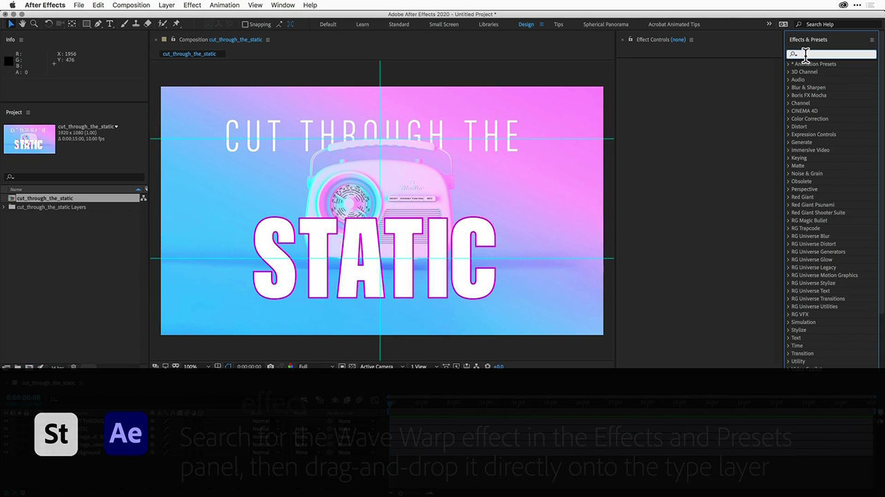
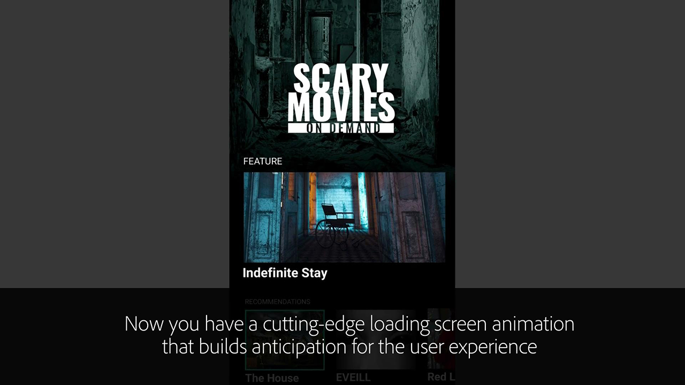

# Esercitazioni per l&#39;Adobe [!DNL Stock]

I creativi sono sotto pressione per fornire rapidamente contenuti visivi coinvolgenti. Adobe Stock offre ai team creativi l&#39;accesso a più di 300 milioni di immagini, video, file audio, modelli, illustrazioni e risorse 3D esenti da royalty, all&#39;interno delle app Creative Cloud che utilizzano quotidianamente. Accedi senza limiti alle risorse standard di Adobe Stock con Creative Cloud Pro Edition. Scopri le raccolte più recenti su stock.adobe.com. Seleziona un’immagine per visualizzare un’esercitazione.

<table>
<tr>
   <td>
      
      

      <a href="stunning-digital-assets.md"><strong>Splendide risorse digitali (PDF)</strong></a>
      

      <em>Scopri come integrare Adobe Stock con CC Libraries per ottenere risultati di progettazione coerenti e professionali per la stampa e lo schermo in questa esercitazione pratica</em>
       
  </td>
  <td>
      
      

      <a href="searchstock.md"><strong>Cerca nell'Adobe [!DNL Stock] cronologia licenze</strong></a>
      

      <em>Scopri come eseguire rapidamente ricerche nella cronologia delle licenze dell'Adobe [!DNL Stock] della tua organizzazione in Creative Cloud for enterprise</em>
       
  </td>
  <td>
      
      

      <a href="handdrawn.md"><strong>Aggiungete un'estetica disegnata a mano all'Adobe di [!DNL Stock] immagini</strong></a>
      

      <em>Amplifica il tuo marketing creativo con tecniche uniche che aggiungono profondità e dimensione alle tue immagini utilizzando Photoshop per iPad</em>
       
  </td>
  <td>
   
    

   <a href="flairtypography.md"><strong>Aggiungere stile alla composizione tipografica con maschere e animazioni</strong></a>
    

    <em>Date vita al testo con elementi dell'Adobe [!DNL Stock] e stili di animazione di After Effects</em>
     
  </td>
</tr>
<tr>
  <td>
      
      

      <a href="animatevector.md"><strong>Animare un'illustrazione vettoriale di Adobe [!DNL Stock] in Photoshop</strong></a>
      

      <em>Inserite animazioni nella grafica del notiziario con vettori modificabili, ad Adobe [!DNL Stock]</em>
       
  </td>
 <td>
      
      

      <a href="annualreport.md"><strong>Inizia il report annuale con un video creato con l'Adobe [!DNL Stock] e Spark Video</strong></a>
      

      <em>Rendi la tua relazione annuale una storia con l'Adobe [!DNL Stock] e Spark Video</em>
       
  </td>
  <td>
      
      

      <a href="customanimations.md"><strong>Dai vita alla creatività con animazioni personalizzate per Adobe [!DNL Stock]</strong></a>
      

      <em>Usa immagini, texture e pattern Adobi di [!DNL Stock] per animazioni personalizzate in Photoshop</em>
       
  </td>
  <td>
      
      

      <a href="changecolors.md"><strong>Modifica i colori di un'immagine di Adobe [!DNL Stock] in modo che corrispondano alla tua storia</strong></a>
      

      <em>Trovate una foto univoca nell'Adobe [!DNL Stock], quindi regolate il colore in Adobe Photoshop in base alle vostre esigenze</em>
       
  </td>
</tr>
<tr>
 <td>
      
      

      <a href="collage.md"><strong>Creazione di un collage 3D per un poster utilizzando [!DNL Stock] immagini</strong></a> di Adobe
      

      <em>Progetta un collage in Adobe Illustrator che presenta un effetto 3D accattivante dalle immagini nell'Adobe [!DNL Stock]</em>
       
  </td>
  <td>
      
      

      <a href="boldlabel.md"><strong>Creare un'etichetta in grassetto con [!DNL Stock] modelli di Adobe e oggetti avanzati Photoshop</strong></a>
      

      <em>Progetta e visualizza i tuoi progetti personalizzati con modelli di packaging realistici dall'Adobe [!DNL Stock]</em>
       
  </td>
  <td>
      
      

      <a href="infographic.md"><strong>Creare un'infografica delle linee guida aziendali con Adobe [!DNL Stock]</strong></a>
      

      <em>Combinate varie risorse dell'Adobe [!DNL Stock] per comunicare le linee guida sotto forma di infografiche visivamente accattivanti</em>
       
  </td>
 <td>
      
      

      <a href="featurecomparison.md"><strong>Crea un grafico di confronto delle funzionalità del prodotto utilizzando l'Adobe [!DNL Stock]</strong></a>
      

      <em>Creare un grafico che confronti i piani di prezzo dei prodotti per fornire ai potenziali clienti le informazioni di cui hanno bisogno in un primo momento</em>
       
  </td>
</tr>
<tr>
   <td>
      
      

      <a href="surrealcomposite.md"><strong>Creazione di un composito semi-surreale con Adobe [!DNL Stock]</strong></a>
      

      <em>Create un'immagine editoriale straordinaria combinando più immagini con effetti di colore, movimento e mascheratura</em>
       
  </td>
   <td>
      
      

      <a href="surrealpattern.md"><strong>Creazione di un pattern semi-surreale con Adobe [!DNL Stock]</strong></a>
      

      <em>Create uno splendido pattern uniforme basato su immagini surreali dell'Adobe [!DNL Stock]</em>
       
  </td>
   <td>
      
      

      <a href="productconfigurator.md"><strong>Creazione di un configuratore di prodotti interattivo con Adobe [!DNL Stock]</strong></a>
      

      <em>Sfruttate le potenzialità dell'interattività, dell'animazione e della grafica modificabile dell'Adobe [!DNL Stock] per presentare le informazioni finanziarie in modo visivo</em>
       
  </td>
  <td>
      
      

      <a href="interactivetourismphoto.md"><strong>Crea una foto turistica interattiva con l'Adobe [!DNL Stock] e l'XD</strong></a>
      

      <em>Crea rapidamente una foto interattiva all'interno del prototipo del tuo sito Web con l'Adobe [!DNL Stock] e l'XD</em>
       
  </td>
</tr>
<tr>
 <td>
      
      

      <a href="animationemail.md"><strong>Creazione di animazioni per la posta elettronica con Adobe [!DNL Stock] e Photoshop</strong></a>
      

      <em>Potenzia le tue e-mail con l'animazione stop-action con l'Adobe [!DNL Stock] e Photoshop</em>
       
  </td>
  <td>
      
      

      <a href="brandgradients.md"><strong>Create immagini coerenti del marchio con splendide sfumature e [!DNL Stock] risorse di Adobe</strong></a>
      

      <em>Create un'unità del marchio con immagini diverse combinando colori e sfumature nella vostra campagna pubblicitaria</em>
       
   </td>
  <td>
      
      

      <a href="webgraphics.md"><strong>Crea grafica Web coinvolgente combinando le immagini di Adobe [!DNL Stock] con CSS</strong></a>
      

      <em>Create un'unità del marchio con immagini diverse combinando colori e sfumature nella vostra campagna pubblicitaria</em>
       
  </td>
  <td>
      
      

      <a href="moodboard.md"><strong>Crea mood board ispiratrici in pochissimo tempo con l'Adobe [!DNL Stock]</strong></a>
      

      <em>Crea una bacheca di stato del progetto per trasmettere informazioni, idee, elementi visivi e tavolozze di colori a team/clienti</em>
       
  </td>
</tr>
<tr>
   <td>
      
      

      <a href="realisticcomposite.md"><strong>Creazione di composizioni fotografiche realistiche con [!DNL Stock] immagini Adobi</strong></a>
      

      <em>Riunisci due straordinarie [!DNL Stock] foto Adobi per attirare l'attenzione delle persone sui tuoi post social</em>
       
  </td>
   <td>
   
    

   <a href="loadingscreen.md"><strong>Personalizzare l'animazione di una schermata di caricamento con l'Adobe [!DNL Stock] e l'XD</strong></a>
    

    <em>Personalizzare la grafica vettoriale dall'Adobe [!DNL Stock] per creare un'animazione dello schermo di caricamento per un'app per dispositivi mobili</em>
     
  </td>
  <td>
   
    

   <a href="presentationtemplate.md"><strong>Personalizza un modello di presentazione di Adobe [!DNL Stock] in modo che sembri professionale ma accattivante</strong></a>
    

    <em>Crea in pochi minuti una splendida presentazione stilizzata con immagini e modelli dell'Adobe [!DNL Stock] e alcuni effetti speciali di facile utilizzo</em>
     
  </td>
   <td>
   
    

   <a href="customizecolors.md"><strong>Personalizzare i colori in un'illustrazione vettoriale di Adobe [!DNL Stock]</strong></a>
    

    <em>Aggiungi un tocco di lucidità a qualsiasi progetto con un'illustrazione di grande impatto. Trova il vettore perfetto nell'Adobe [!DNL Stock], quindi abbina i colori alla tavolozza del tuo progetto utilizzando Adobe Illustrator</em>
     
  </td>
</tr>
<tr>
   <td>
      
      

      <a href="assets/AddMotiontoStillImageswithAdobeStockandPhotoshop.pdf"><strong>Aggiungere movimento alle immagini fisse con Adobe [!DNL Stock] e Photoshop (PDF)</strong></a>
      

      <em>Sorprendi il pubblico su qualsiasi schermo incorporando il video in un'immagine fissa</em>
       
   </td>
   <td>
   
    

   <a href="assets/CreateacompositewithPhotoshopontheiPadandAdobeStockimages.pdf" target="_blank"><strong>Creazione di una composizione con Photoshop per iPad e Adobe di [!DNL Stock] immagini (PDF)</strong></a>
    

    <em>Scopri come utilizzare una delle tue app Adobe Creative Cloud preferite in modo completamente nuovo con la potenza di Photoshop sul tuo iPad</em>
     
  </td>
   <td>
   
    

   <a href="assets/CreateaUniqueEditorialGraphicwithAfterEffectsandAdobeStock.pdf" target="_blank"><strong>Animare un'illustrazione vettoriale Adobe [!DNL Stock] in Photoshop (PDF)</strong></a>
    

    <em>Combinando After Effects con l'Adobe [!DNL Stock], puoi creare rapidamente straordinari effetti speciali che ti aiutano a raccontare visivamente una storia</em>
     
  </td>
   <td>
      
      

      <a href="assets/CreateUniqueGraphicsbyCombiningAdobeStockImages.pdf" target="_blank"><strong>Crea grafica univoca combinando [!DNL Stock] immagini Adobi (PDF)</strong></a>
      

      <em>Riunisci due immagini diverse per creare una scena completamente nuova per i tuoi progetti di design. L'Adobe [!DNL Stock] e Adobe Photoshop semplificano</em>
       
   </td>
</tr>
<tr>
  <td>
      
      

      <a href="assets/CreatingaHalloweenCinemagraphwithPhotoshopCCandAdobeStock.pdf" target="_blank"><strong>Creazione di un filmato di Halloween con Photoshop CC e Adobe [!DNL Stock] (PDF)</strong></a>
      

      <em>Crea un cinemagrafo componendo video, illustrazioni e foto con Adobe Photoshop</em>
       
  </td>
   <td>
      
      

      <a href="assets/PutyourDatainMotionwithAdobeStockandPremierePro.pdf" target="_blank"><strong>Metti in movimento i tuoi dati con l'Adobe [!DNL Stock] e Premiere Pro (PDF)</strong></a>
      

      <em>Dai vita ai tuoi dati per raccontare una storia più convincente utilizzando l'Adobe [!DNL Stock] e Adobe Premiere Pro</em>
       
  </td>
   <td>
      
      

      <a href="assets/RecolorAdobeStockVectorArtworkwithAdobeIllustratortoGetExactlytheLookYouWant.pdf" target="_blank"><strong>Ricolora la grafica vettoriale dell'Adobe [!DNL Stock] con Adobe Illustrator per ottenere esattamente l'aspetto desiderato (PDF)</strong></a>
      

      <em>L'Adobe [!DNL Stock] semplifica la ricerca di immagini vettoriali uniche e Adobe Illustrator consente di modificarle rapidamente in base alla tua visione creativa</em>
       
   </td>
   <td>
      
      

      <a href="assets/ShowOffyourDesignWorkintheRealWorldwithAdobeStockandPhotoshop.pdf" target="_blank"><strong>Mostra il tuo lavoro di progettazione nel mondo reale con l'Adobe [!DNL Stock] e Photoshop (PDF)</strong></a>
      

      <em>Segui questi passaggi per presentare il tuo lavoro in un modello di Adobe [!DNL Stock] dall'aspetto realistico utilizzando Adobe Photoshop</em>
       
  </td>
 </tr> 
 <tr>
   <td>
      
      

      <a href="assets/UncoveramazingdetailsinAdobeStockimageswithLightroomformobile.pdf" target="_blank"><strong>Scoprite dettagli straordinari nell'Adobe [!DNL Stock] immagini con Lightroom for mobile (PDF)</strong></a>
      

      <em>Scoprite la potenza di Lightroom sul vostro dispositivo mobile per ottenere il meglio dalle vostre immagini</em>
       
  </td>
  <td>
      
      

      <a href="assets/VisualizePosterDesignsintheRealWorldwithAdobeStockandPhotoshop.pdf" target="_blank"><strong>Visualizza i progetti di poster nel mondo reale con Adobe [!DNL Stock] e Photoshop (PDF)</strong></a>
      

      <em>Presenta i tuoi progetti in ambienti reali per farne un'idea migliore del loro aspetto nel mondo</em>
       
  </td>
  <td>
    
    

     
  </td>
</tr>
</table>
