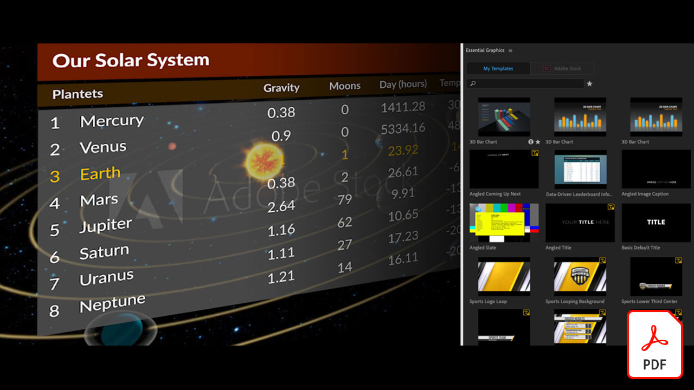

# Adobe [!DNL Stock] esercitazioni

I creativi sono sotto pressione per distribuire rapidamente contenuti visivi coinvolgenti. Adobe Stock consente ai team creativi di accedere a più di 300 milioni di immagini, video, file audio, modelli, illustrazioni e risorse 3D esenti da royalty, all&#39;interno delle app di Creative Cloud che utilizzano quotidianamente. Accedi alle risorse standard di Adobe Stock senza limiti con Creative Cloud Pro Edition. Esplora le ultime raccolte su stock.adobe.com. Selezionate un’immagine per visualizzare un’esercitazione.

<table>
<tr>
   <td>
      
      

      <a href="stunning-digital-assets.md"><strong>Risorse digitali straordinarie</strong></a>
      

      <em>Scopri come integrare Adobe Stock con CC Libraries per creare risultati di progettazione uniformi e professionali per la stampa e lo schermo in questo tutorial pratico</em>
       
  </td>
  <td>
      
      

      <a href="searchstock.md"><strong>Adobe di ricerca [!DNL Stock] cronologia licenze</strong></a>
      

      <em>Scopri come cercare rapidamente l’Adobe della tua organizzazione [!DNL Stock] cronologia delle licenze in Creative Cloud for enterprise</em>
       
  </td>
  <td>
      
      

      <a href="handdrawn.md"><strong>Aggiungere un’estetica disegnata a mano all’Adobe [!DNL Stock] immagini</strong></a>
      

      <em>Amplia il tuo marketing creativo con tecniche esclusive che aggiungono profondità e dimensione alle tue immagini utilizzando Photoshop per iPad</em>
       
  </td>
  <td>
   
    

   <a href="flairtypography.md"><strong>Aggiunta di un tocco tipografico con maschere e animazioni</strong></a>
    

    <em>Dai vita al tuo testo con elementi di Adobe [!DNL Stock] e stili di animazione da After Effects</em>
     
  </td>
</tr>
<tr>
  <td>
      
      

      <a href="animatevector.md"><strong>Animare un Adobe [!DNL Stock] illustrazione vettoriale in Photoshop</strong></a>
      

      <em>Importa animazioni nella tua newsletter con vettori modificabili, ad Adobe [!DNL Stock]</em>
       
  </td>
 <td>
      
      

      <a href="annualreport.md"><strong>Inizia il report annuale con un video creato con Adobe [!DNL Stock] e Spark Video</strong></a>
      

      <em>Trasforma il tuo annual report in una storia con Adobe [!DNL Stock] e Spark Video</em>
       
  </td>
  <td>
      
      

      <a href="customanimations.md"><strong>Dai vita alla tua creatività con animazioni personalizzate di Adobe [!DNL Stock]</strong></a>
      

      <em>Adobe [!DNL Stock] immagini, texture, pattern di animazioni personalizzate in Photoshop</em>
       
  </td>
  <td>
      
      

      <a href="changecolors.md"><strong>Modificare un Adobe [!DNL Stock] colori dell'immagine in base alla storia</strong></a>
      

      <em>Trovare una foto unica nell’Adobe [!DNL Stock] e quindi regolare il colore in Adobe Photoshop in base alle tue esigenze</em>
       
  </td>
</tr>
<tr>
 <td>
      
      

      <a href="collage.md"><strong>Creare un collage 3D per un poster utilizzando Adobe [!DNL Stock] immagini</strong></a>
      

      <em>Progetta un collage in Adobe Illustrator che presenta un effetto 3D accattivante dalle immagini in Adobe [!DNL Stock]</em>
       
  </td>
  <td>
      
      

      <a href="boldlabel.md"><strong>Creare un’etichetta in grassetto con Adobe [!DNL Stock] modelli e Photoshop oggetti avanzati</strong></a>
      

      <em>Progetta e visualizza i tuoi progetti personalizzati con modelli di packaging realistici, presi ad Adobe [!DNL Stock]</em>
       
  </td>
  <td>
      
      

      <a href="infographic.md"><strong>Creare un’infografica con le linee guida aziendali con Adobe [!DNL Stock]</strong></a>
      

      <em>Combinare diverse risorse da Adobe [!DNL Stock] per comunicare le linee guida sotto forma di infografiche visivamente accattivanti</em>
       
  </td>
 <td>
      
      

      <a href="featurecomparison.md"><strong>Creare un grafico di confronto delle funzionalità di un prodotto utilizzando l'Adobe [!DNL Stock]</strong></a>
      

      <em>Crea un grafico che confronta i piani di prezzo dei prodotti per fornire ai potenziali clienti le informazioni di cui hanno bisogno in un attimo</em>
       
  </td>
</tr>
<tr>
   <td>
      
      

      <a href="surrealcomposite.md"><strong>Creare una composizione semi-surreale con Adobe [!DNL Stock]</strong></a>
      

      <em>Creare un'immagine editoriale memorabile combinando più immagini con effetti di colore, movimento e mascheratura</em>
       
  </td>
   <td>
      
      

      <a href="surrealpattern.md"><strong>Creare un pattern semi-surreale con Adobe [!DNL Stock]</strong></a>
      

      <em>Crea uno splendido pattern uniforme basato su immagini surreali di Adobe [!DNL Stock]</em>
       
  </td>
   <td>
      
      

      <a href="productconfigurator.md"><strong>Creazione di un configuratore di prodotto interattivo con Adobe [!DNL Stock]</strong></a>
      

      <em>Sfrutta le potenzialità dell'interattività, dell'animazione e della grafica modificabile di Adobe [!DNL Stock] presentare le informazioni finanziarie in modo visivo</em>
       
  </td>
  <td>
      
      

      <a href="interactivetourismphoto.md"><strong>Creazione di una foto interattiva per il turismo con Adobe [!DNL Stock] XD e &lt;unk&gt;</strong></a>
      

      <em>Creazione rapida di una foto interattiva all'interno del prototipo del sito web con Adobe [!DNL Stock] XD &amp; &lt;unk&gt;</em>
       
  </td>
</tr>
<tr>
 <td>
      
      

      <a href="animationemail.md"><strong>Creare animazioni per l’e-mail con Adobe [!DNL Stock] e Photoshop</strong></a>
      

      <em>Possibilità di abilitare le e-mail con l’animazione stop-action con Adobi [!DNL Stock] e Photoshop</em>
       
  </td>
  <td>
      
      

      <a href="brandgradients.md"><strong>Crea immagini di marchio coerenti con splendide sfumature e Adobi [!DNL Stock] risorse</strong></a>
      

      <em>Crea brand unity con immagini diverse combinando colori e sfumature in tutta la tua campagna pubblicitaria</em>
       
   </td>
  <td>
      
      

      <a href="webgraphics.md"><strong>Creazione di grafica per il web coinvolgente mediante la combinazione di Adobi [!DNL Stock] immagini con CSS</strong></a>
      

      <em>Crea brand unity con immagini diverse combinando colori e sfumature in tutta la tua campagna pubblicitaria</em>
       
  </td>
  <td>
      
      

      <a href="moodboard.md"><strong>Crea mood board suggestive in un batter d'occhio con Adobe [!DNL Stock]</strong></a>
      

      <em>Crea una scheda di stato d’animo per trasmettere informazioni, idee, elementi visivi e palette di colori ai team/clienti</em>
       
  </td>
</tr>
<tr>
   <td>
      
      

      <a href="realisticcomposite.md"><strong>Creazione di composizioni fotografiche realistiche con Adobe [!DNL Stock] immagini</strong></a>
      

      <em>Due grandi Adobi [!DNL Stock] foto per attirare persone nei tuoi post social</em>
       
  </td>
   <td>
   
    

   <a href="loadingscreen.md"><strong>Personalizzare un’animazione della schermata di caricamento con Adobe [!DNL Stock] XD e &lt;unk&gt;</strong></a>
    

    <em>Personalizzare la grafica vettoriale da Adobe [!DNL Stock] per creare un'animazione della schermata di caricamento per un'app mobile</em>
     
  </td>
  <td>
   
    

   <a href="presentationtemplate.md"><strong>Personalizzare un Adobe [!DNL Stock] un modello per presentazioni professionali e accattivanti</strong></a>
    

    <em>Creazione di una splendida presentazione stilizzata in pochi minuti con immagini e modelli di Adobe [!DNL Stock] e alcuni effetti speciali di facile utilizzo</em>
     
  </td>
   <td>
   
    

   <a href="customizecolors.md"><strong>Personalizzare i colori di un Adobe [!DNL Stock] illustrazione vettoriale</strong></a>
    

    <em>Aggiungete un tocco raffinato a qualsiasi progetto con un'illustrazione di grande impatto. Trova il vettore perfetto in Adobe [!DNL Stock], quindi abbinare i colori alla tavolozza del progetto utilizzando Adobe Illustrator</em>
     
  </td>
</tr>
<tr>
   <td>
      
      

      <a href="assets/AddMotiontoStillImageswithAdobeStockandPhotoshop.pdf"><strong>Aggiungere movimento alle immagini fisse con Adobi [!DNL Stock] e Photoshop (PDF)</strong></a>
      

      <em>Stupisci il pubblico su qualsiasi schermo incorporando video in un’immagine fissa</em>
       
   </td>
   <td>
   
    

   <a href="assets/CreateacompositewithPhotoshopontheiPadandAdobeStockimages.pdf" target="_blank"><strong>Creare una composizione con Photoshop su iPad e Adobe [!DNL Stock] immagini (PDF)</strong></a>
    

    <em>Scopri come utilizzare una delle tue app Adobe Creative Cloud preferite in un modo completamente nuovo grazie alle potenzialità di Photoshop sul tuo iPad</em>
     
  </td>
   <td>
   
    

   <a href="assets/CreateaUniqueEditorialGraphicwithAfterEffectsandAdobeStock.pdf" target="_blank"><strong>Animare un Adobe [!DNL Stock] illustrazione vettoriale in Photoshop (PDF)</strong></a>
    

    <em>Combinando After Effects con Adobe [!DNL Stock], è possibile creare rapidamente effetti speciali straordinari per raccontare visivamente una storia</em>
     
  </td>
   <td>
      
      

      <a href="assets/CreateUniqueGraphicsbyCombiningAdobeStockImages.pdf" target="_blank"><strong>Creare elementi grafici unici combinando Adobi [!DNL Stock] immagini (PDF)</strong></a>
      

      <em>Riunisci due immagini diverse per creare una scena completamente nuova per i tuoi progetti di design. Adobe [!DNL Stock] e Adobe Photoshop semplifica la gestione</em>
       
   </td>
</tr>
<tr>
  <td>
      
      

      <a href="assets/CreatingaHalloweenCinemagraphwithPhotoshopCCandAdobeStock.pdf" target="_blank"><strong>Creazione di un filmato di Halloween con Photoshop CC e Adobe [!DNL Stock] (PDF)</strong></a>
      

      <em>Creare un grafico cinematografico componendo video, illustrazioni e foto con Adobe Photoshop</em>
       
  </td>
   <td>
      
      

      <a href="assets/PutyourDatainMotionwithAdobeStockandPremierePro.pdf" target="_blank"><strong>Metti in moto i tuoi dati con l'Adobe [!DNL Stock] e Premiere Pro (PDF)</strong></a>
      

      <em>Dai vita ai tuoi dati per raccontare una storia più convincente con l'Adobe [!DNL Stock] e Adobe Premiere Pro</em>
       
  </td>
   <td>
      
      

      <a href="assets/RecolorAdobeStockVectorArtworkwithAdobeIllustratortoGetExactlytheLookYouWant.pdf" target="_blank"><strong>Adobe Ricolora [!DNL Stock] grafica vettoriale con Adobe Illustrator per ottenere esattamente il risultato desiderato (PDF)</strong></a>
      

      <em>Adobe [!DNL Stock] semplifica l'individuazione di grafica vettoriale univoca e Adobe Illustrator consente di modificarla rapidamente in base alla propria visione creativa</em>
       
   </td>
   <td>
      
      

      <a href="assets/ShowOffyourDesignWorkintheRealWorldwithAdobeStockandPhotoshop.pdf" target="_blank"><strong>Presenta il tuo lavoro di progettazione nel mondo reale con Adobi [!DNL Stock] e Photoshop (PDF)</strong></a>
      

      <em>Segui questi passaggi per mostrare il tuo lavoro in un Adobe realistico [!DNL Stock] modello con Adobe Photoshop</em>
       
  </td>
 </tr> 
 <tr>
   <td>
      
      

      <a href="assets/UncoveramazingdetailsinAdobeStockimageswithLightroomformobile.pdf" target="_blank"><strong>Scopri dettagli straordinari in Adobe [!DNL Stock] immagini con Lightroom for mobile (PDF)</strong></a>
      

      <em>Scopri le potenzialità di Lightroom sul tuo dispositivo mobile per valorizzare al meglio le tue immagini</em>
       
  </td>
  <td>
      
      

      <a href="assets/VisualizePosterDesignsintheRealWorldwithAdobeStockandPhotoshop.pdf" target="_blank"><strong>Adobe per visualizzare i poster nel mondo reale [!DNL Stock] e Photoshop (PDF)</strong></a>
      

      <em>Presenta i tuoi progetti in ambienti reali per capire meglio come si presentano nel mondo</em>
       
  </td>
  <td>
    
    

     
  </td>
</tr>
</table>
