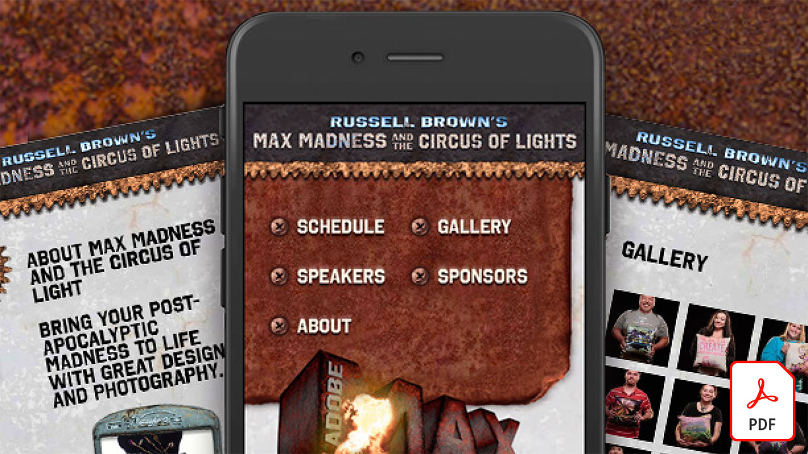

# Esercitazioni su Adobe XD

Adobe XD è uno strumento di progettazione e prototipazione dell&#39;esperienza utente per progettare siti web, app, interfacce vocali, giochi e altri tipi di esperienze digitali. Selezionate un’immagine per visualizzare un’esercitazione.

<table>
<tr>
 <td>
   
    

   <a href="components.md"><strong>Massima praticità con [!UICCONTROL Components] in Adobe XD</strong></a>
    

    <em>Scoprite come utilizzare [!UICCONTROL Components] per garantire una flessibilità senza precedenti nell'applicazione di velocità e coerenza al flusso di lavoro di progettazione</em>
     
  </td>
  <td>
   
    

   <a href="assets/ControlMultipleXDArtboardswithNestedSymbols.pdf" target="_blank"><strong>XD Controllare più tavole da disegno &lt;unk&gt; con simboli nidificati (PDF)</strong></a>
    

    <em>I simboli offrono un metodo eccellente per creare grafica e testo riutilizzabili che possono essere applicati più volte nelle tavole da disegno del progetto</em>
     
  </td>
  <td>
   
    

   <a href="assets/CreateaZoomableeCommercePhotowithXDandAdobeStock.pdf" target="_blank"><strong>XD Creare una foto di e-commerce scalabile con &lt;unk&gt; e Adobe [!DNL Stock] (PDF)</strong></a>
    

    <em>La combinazione della fotografia ad alta risoluzione con la funzione di animazione automatica di Adobe XD ti consente di progettare esperienze più coinvolgenti per il tuo sito web</em>
     
  </td>
  <td>
   
    

   <a href="assets/CreatingaRotatingProductInterfaceforECommercewithAdobeXD.pdf" target="_blank"><strong>Creazione di un’interfaccia di prodotto a rotazione per l’e-commerce con Adobe XD (PDF)</strong></a>
    

    <em>Progetta un'interfaccia che offra una vista in rotazione del tuo prodotto, quindi puoi trasformare il tuo progetto in un prototipo interattivo che mostra esattamente come funzionerà l'esperienza sul web o sui dispositivi mobili</em>
     
  </td>
</tr>
<tr>
  <td>
   
    

   <a href="assets/DesignandPrototypeanInteractiveQuizwithXD.pdf" target="_blank"><strong>XD Progettazione e prototipazione di un quiz interattivo con &lt;unk&gt; (PDF)</strong></a>
    

    <em>Progetta il feedback che un utente incontrerà durante un progetto</em>
     
  </td>
  <td>
   
    

   <a href="assets/DesignInteractiveProjectswithMicroAnimationsinXD.pdf" target="_blank"><strong>XD Progetta progetti interattivi con micro animazioni in &lt;unk&gt; (PDF)</strong></a>
    

    <em>Scopri come creare prototipi animati interattivi dei tuoi progetti con Adobe XD</em>
     
  </td>
  <td>
   
    

   <a href="assets/JumpstartyourXDProjectfromaPhotoshopFile.pdf" target="_blank"><strong>XD Avviare il progetto &lt;unk&gt; da un file Photoshop (PSD) (PDF)</strong></a>
    

    <em>Adobe XD offre alcuni straordinari strumenti di progettazione interattiva che si integrano con il flusso di lavoro esistente, consentendoti di portare la tua visione di progettazione interattiva a un livello superiore</em>
     
  </td>
  <td>
   
    

   <a href="assets/MobileWebExperienceswithXD.pdf" target="_blank"><strong>XD Progettazione di un'esperienza web mobile con &lt;unk&gt; (PDF)</strong></a>
    

    <em>Scopri il processo di progettazione della galleria web mobile Russell Brown MAX Madness con Adobe XD</em>
     
  </td>
</tr>
<tr>
  <td>
   
    

   <a href="assets/PrototypeaMobileWebExperiencewithAdobeXD.pdf" target="_blank"><strong>Creazione di prototipi di esperienze web per dispositivi mobili con Adobe XD (PDF)</strong></a>
    

    <em>La progettazione di esperienze richiede strategia, progettazione e prototipazione funzionale e Adobe XD ti offre la possibilità di fare tutto</em>
     
  </td>
  <td>
   
    

   <a href="assets/PrototypeaMobileWebExperiencewithAdobeXD.pdf" target="_blank"><strong>XD Sovraccaricare la griglia di ripetizione in &lt;unk&gt; con testo e grafica esterni (PDF)</strong></a>
    

    <em>Combina la griglia di ripetizione con testo e grafica esterni per aumentare la produttività</em>
     
  </td>
  <td>
   
    

   <a href="assets/BehindtheScenesofMAXMadnesswithAdobeXD.pdf" target="_blank"><strong>Dietro le quinte di MAX Madness con Adobe XD (PDF)</strong></a>
    

    <em>Offrire un'esperienza web mobile ottimizzata può davvero suscitare l'interesse dei tuoi utenti</em>
     
  </td>
  <td>
    
    

     
  </td>
</tr>
</table>
